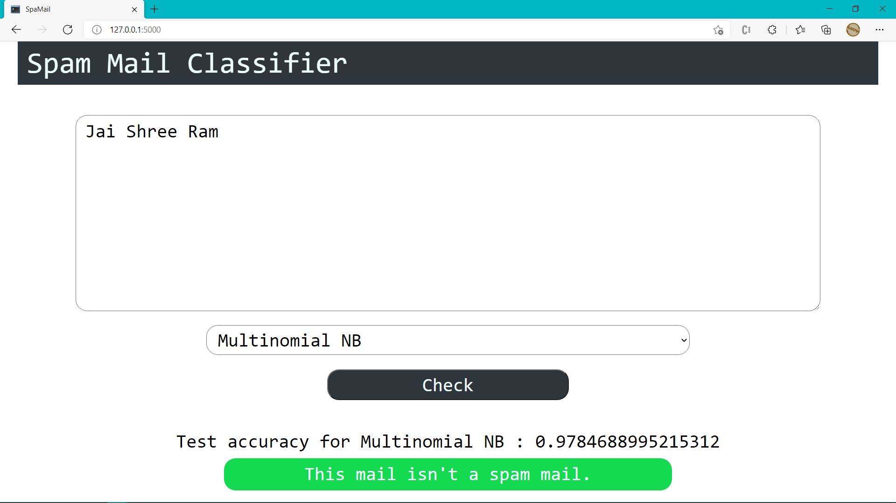

# Flask Spam Classifier

Takes the input from the user and results whether the mail is a spam or a ham.

## Requirements

> pip install python-dotenv

> pip install Flask

> pip install scikit-learn

> pip install pandas

## Start the app

> python app.py

## Screenshots

